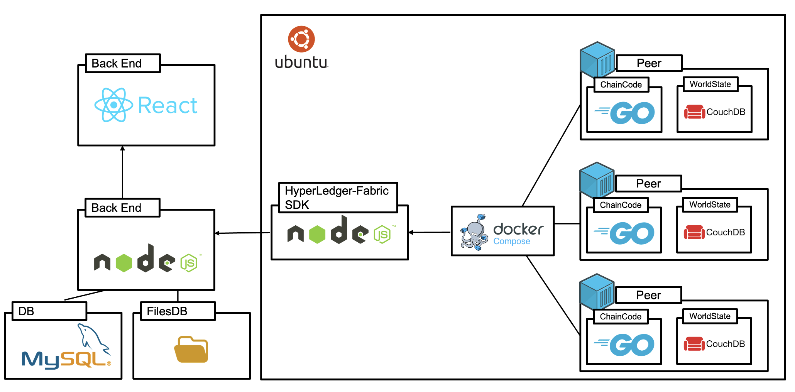
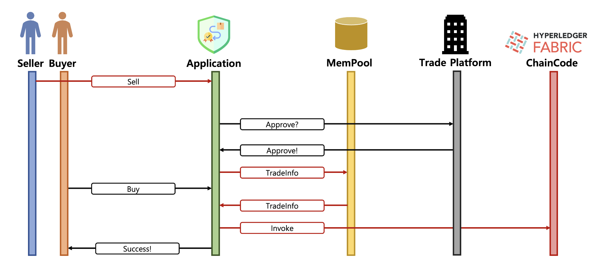
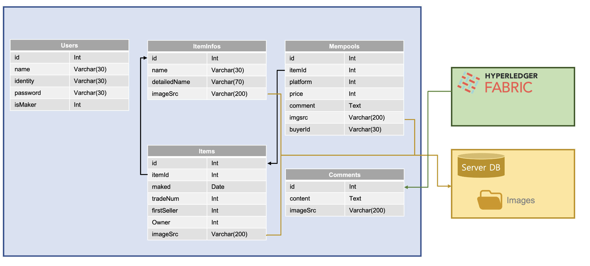
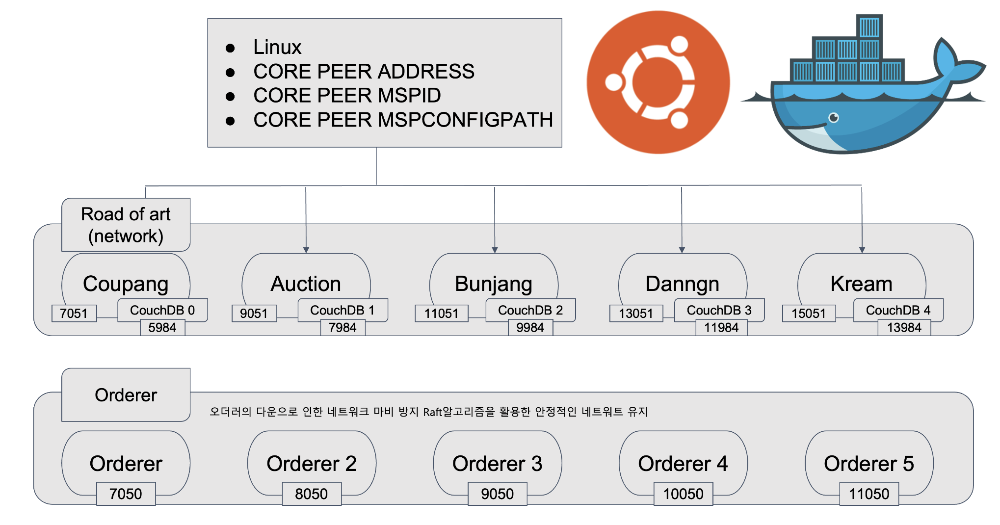

## Service

Figma를 이용해 설계하고 react를 사용하여 구현한 서비스 페이지입니다.

## Stack

## TradingProcess

1. Seller가 자신의 물건에 대한 판매요청(Sell)을 줌
2. TradePlatform에서 해당 거래 플랫폼을 사용하는 것을 인증번호를 통해 인증(Approve)
3. 승인되면 Seller가 등록한 거래정보(TradeInfo)를 임시저장소(memPool)에 저장
4. Buyer가 구매요청(Buy)을 하면 임시저장소(memPool)에서 데이터를 가져와 하이퍼레저 패브릭에 invoke해줌. 이 때 임시저장소의 있던 데이터는 삭제됨.

## DB schema

## Network

